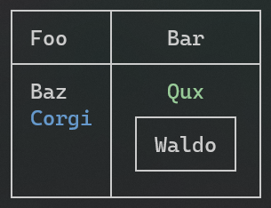

Title: テーブル
Order: 3
RedirectFrom: tables
---

テーブルはターミナルで表データを表示するのに完璧な方法です。
`Spectre.Console` は、テーブルの描画にとても優れていて、全てのカラムは中に合わせて調整してくれます。
`IRenderable`を実装しているものは、列ヘッダやセル、別のテーブルとして使用できます。

# 使い方

<!------------------------->
<!--- USAGE             --->
<!------------------------->

テーブルを描画するために、`Table`インスタンスを作成し、必要な数の列を追加し、行を追加します。
テーブルをコンソールの`Render`メソッドに渡して終わりです。

```csharp
// テーブルの作成
var table = new Table();

// 列の追加
table.AddColumn("Foo");
table.AddColumn(new TableColumn("Bar").Centered());

// 行の追加
table.AddRow("Baz", "[green]Qux[/]");
table.AddRow(new Markup("[blue]Corgi[/]"), new Panel("Waldo"));

// コンソールにテーブルの描画
AnsiConsole.Render(table);
```

これは次のように出力を描画します。



# テーブル外観

<!------------------------->
<!--- TABLE APPEARANCE  --->
<!------------------------->

## 罫線

罫線については、付録の[罫線](xref:borders)を参照してください

```csharp
// 罫線を設定します
table.Border(TableBorder.None);
table.Border(TableBorder.Ascii);
table.Border(TableBorder.Square);
table.Border(TableBorder.Rounded);
```

## 拡大 / 縮小

```csharp
// テーブル幅を最大に設定します
table.Expand();

// テーブル幅を最小に設定します
table.Collapse();
```

## ヘッダーを隠す

```csharp
// 全ての列のヘッダーを隠します
table.HideHeaders();
```

## テーブル幅の設定

```csharp
// テーブル幅50セルに設定します
table.Width(50);
```

## テーブル配置

```csharp
table.Alignment(Justify.Right);
table.RightAligned();
table.Centered();
table.LeftAligned();
```

# 列外観

<!------------------------->
<!--- COLUMN APPEARANCE --->
<!------------------------->

## 整列（アライメント）

```csharp
table.Columns[0].Alignment(Justify.Right);
table.Columns[0].LeftAligned();
table.Columns[0].Centered();
table.Columns[0].RightAligned();
```

## パディング

```csharp
// 左と右のパディングを設定する
table.Columns[0].PadLeft(3);
table.Columns[0].PadRight(5);

// またはチェインで設定する
table.Columns[0].PadLeft(3).PadRight(5);

// または、左右のパディングが同じであれば、shortandメソッドを使用します。
// 垂直方向のパディングは無視されます。
table.Columns[0].Padding(4, 0);
```

## 列改行の無効化

```csharp
// 列改行の無効化
table.Columns[0].NoWrap();
```

## 列幅の設定

```csharp
// 列幅の設定(これはまだ柔軟な拡張メソッドがありません)
table.Columns[0].Width(15);
```